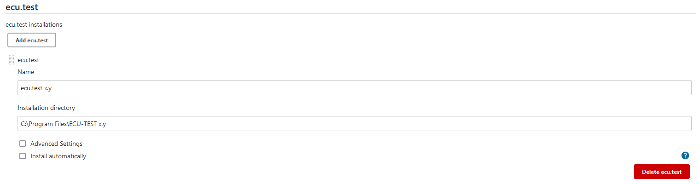
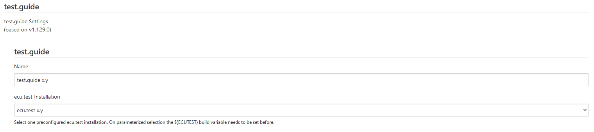
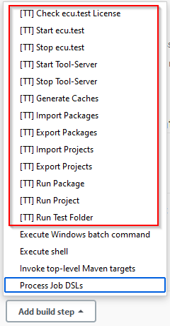
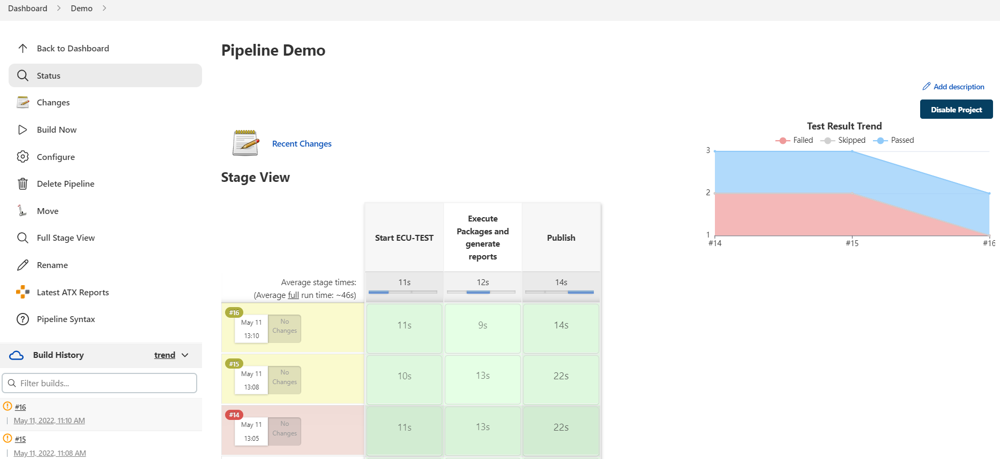
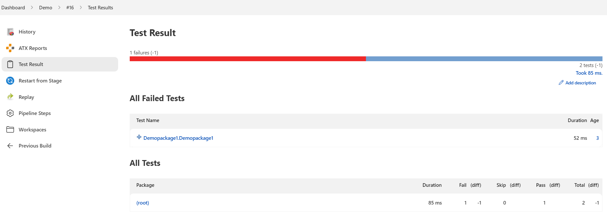
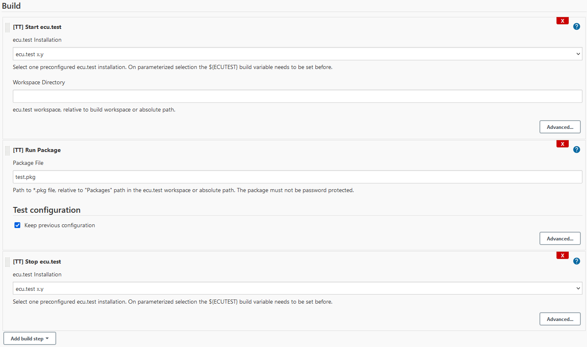
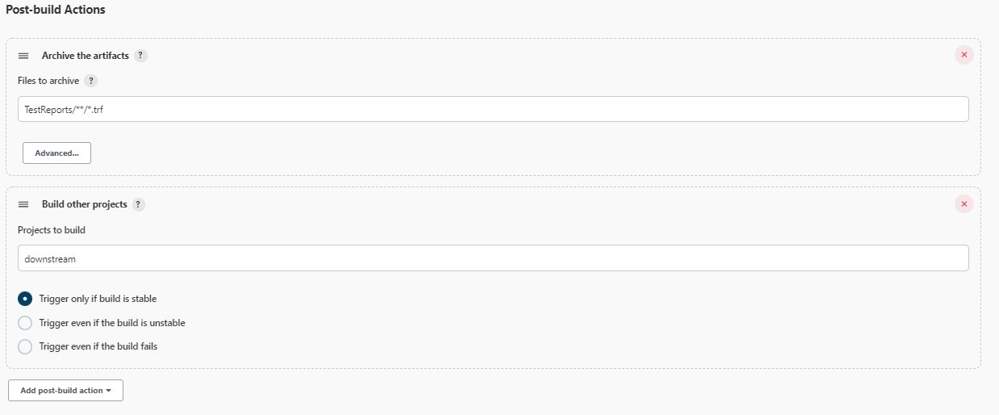
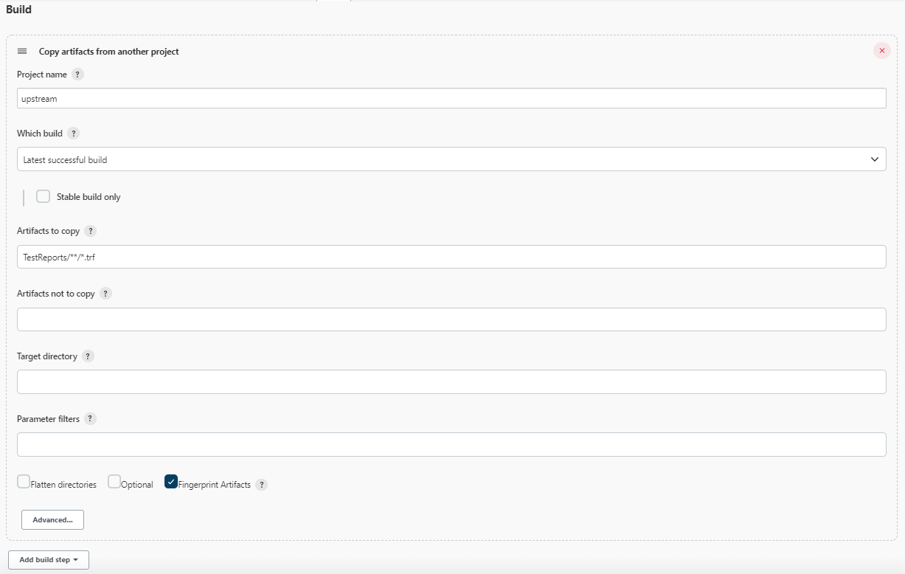
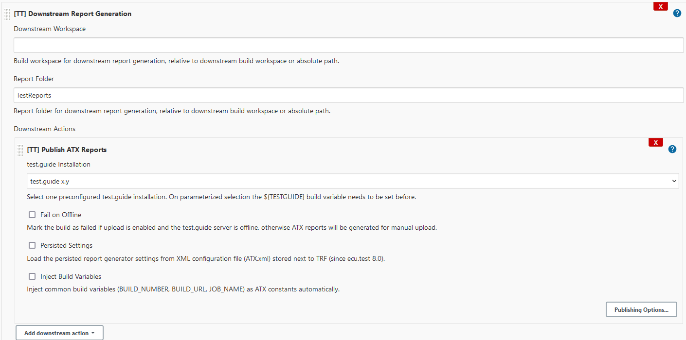

# TraceTronic ECU-TEST Plugin

[](https://ci.jenkins.io/job/plugins/job/ecutest-plugin/job/master) [](https://app.fossa.io/projects/git%2Bgithub.com%2Fjenkinsci%2Fecutest-plugin?ref=badge_shield) [](https://dependabot.com) [](https://plugins.jenkins.io/ecutest)
[](https://github.com/jenkinsci/ecutest-plugin/releases) [](https://plugins.jenkins.io/ecutest) [](https://github.com/jenkinsci/ecutest-plugin/blob/master/LICENSE)

This plugin integrates Jenkins with [ECU-TEST](https://www.tracetronic.com/products/ecu-test) and generates reports on automated test execution.


ECU-TEST is a test automation software for the validation of embedded systems in automotive environments developed by TraceTronic GmbH.<br/>
This software executes regression tests which are essential for validating complex technical products such as electronic control units (ECUs).<br/>
It supports standardized access to a broad range of test tools and provides automation of distributed test environments (SiL – MiL – HiL – vehicle).

## Table of Contents

- [Features](#features)
- [Configuration](#configuration)
    - [ECU-TEST configuration](#ecu-test-configuration)
    - [TEST-GUIDE configuration](#test-guide-configuration)
    - [Job configuration](#job-configuration)
    - [Job execution](#job-execution)
    - [Environment variables](#environment-variables)
- [Downstream report generation](#downstream-report-generation)
    - [Example configurations](#example-configurations)
- [Downstream trace analysis](#downstream-trace-analysis)
    - [Example configurations](#example-configurations-1)
- [Extensions](#extensions)
    - [Job DSL](#job-dsl)
    - [Pipeline](#pipeline)
    - [Configuration as Code](#configuration-as-code)
- [Debugging](#debugging)
- [Issues](#issues)
- [Known limitations](#known-limitations)
- [FAQ](#faq)
    - [Common issues](#large_blue_circle-common-issues)
    - [Error messages](#red_circle-error-messages)
- [Compatibility](#compatibility)
- [License](#license)
- [Changelog](#changelog)

## Features

- Provides an easy integration and control of ECU-TEST and the Tool-Server with Jenkins
- Enables the execution of ECU-TEST packages and projects with their respective configurations

Moreover publishing test results is included in form of:

- Linking the TRF reports
- Generating various report formats
- Displaying test result trend graphs
- Uploading ATX test reports to [TEST-GUIDE](https://www.tracetronic.com/products/test-guide)
- Parsing the ECU-TEST logs for warnings and errors

Advanced workflows integrated for:

- [Downstream report generation](#downstream-report-generation)
- [Downstream trace analysis](#downstream-trace-analysis)

## Configuration

### ECU-TEST configuration

ECU-TEST installations are administrated in the Jenkins system configuration or starting with Jenkins 2.0 in the global tool configuration at section "ECU-TEST".
An installation entry is specified by an arbitrary name and the path to the installation directory.
The execution on a Jenkins agent requires the adaption of the ECU-TEST installation directory on the agent configuration page.



### TEST-GUIDE configuration

TEST-GUIDE is also configured in the Jenkins system configuration at section "TEST-GUIDE".
A new entry requires both an arbitrary name and the selection of a previously configured ECU-TEST installation.
Further settings like the server or ATX specific configuration can be found in the advanced block.



### Job configuration

The plugin provides several new build steps:



**Note:**

- All build steps have an "Advanced" button through which more options can be accessed
- All text fields can be parameterized and are resolved at build execution
  - Syntax: _$parameter_ or _${parameter}_

The post-build actions are extended by these test report related post-build steps:


### Job execution

- After job configuration is done a new build can be triggerd by clicking on the "Build now" button
- The console log contains detailed information per build step execution
- The test results are published both on the build page and the job page based on the latest build





### Environment variables

- This plugin also exposes the tool and test related information of the current build as environment variables
- These variables are composed of _$TT_<TOOL | TEST>_<information>_n_ where n is the 0-based index of the related build steps in the job configuration
- The summary of all generated environment variables is also shown on the build page

<details>
    <summary>Tool related variables</summary>

| Environment variable | Description |
| --- | --- |
| TT_TOOL_NAME | Name of the selected ECU-TEST installation |
| TT_TOOL_INSTALL | Full path to related ECU-TEST executable |
| TT_TOOL_VERSION | Program version of selected ECU-TEST installation |
| TT_TOOL_WORKSPACE | ECU-TEST workspace directory |
| TT_TOOL_SETTINGS | ECU-TEST settings directory |
| TT_TOOL_DEBUG | ECU-TEST debug mode |
| TT_TOOL_TIMEOUT | Maximum execution time |
| TT_TOOL_LAST_TBC | Last loaded TBC file path |
| TT_TOOL_LAST_TCF | Last loaded TCF file path |
</details>

<details>
    <summary>Test related variables</summary>

| Environment variable | Description |
| --- | --- |
| TT_TEST_NAME | Name of the executed test |
| TT_TEST_FILE | Full path to related test file |
| TT_TEST_TYPE | Type of related test (PACKAGE, PROJECT) |
| TT_TEST_DESCRIPTION | Test description |
| TT_TEST_TBC | Full path to test bench configuration file |
| TT_TEST_TCF | Full path to test configuration file |
| TT_TEST_TIMEOUT | Maximum execution time |
| TT_TEST_RESULT | Test result (SUCCESS, INCONCLUSIVE, FAILED, ERROR, NONE) |
| TT_TEST_REPORT | Full path to test report directory |
| TT_TEST_RETVAL_\<VARIABLE NAME\> | Test related package output parameter (only for package execution)|
</details>

## Downstream report generation

The concept of downstream report generation allows to execute the report generators like ATX, UNIT, HTML etc. in a downstream-based project.
Therefore the report artifacts like TRF reports etc. must be archived after the test execution stage and will then be copied into a separate workspace of the triggered downstream project.

This downstream project acts like a central reporting service which waits for inputs from other test executions. It will be an ease to scale this service with help of Jenkins parallelization and distribution features.
The big advantage of this approach is to save time for the report generation and uploading process on expensive testing resources like HiL test benches. These resources can be directly used for the next test.


### Example configurations

#### Preconditions

To prevent duplicate reports the build workspace should be cleaned before running the tests and before copying artifacts inside of the downstream project.
This can be achieved by using clean checkouts from repository or using the [Workspace Cleanup Plugin](https://plugins.jenkins.io/ws-cleanup) when preparing the build environment.

To transfer the report artifacts from one node to another the [Copy Artifact Plugin](https://plugins.jenkins.io/copyartifact) is required for freestyle projects. When using pipelines also stash/unstash commands can be used.

#### Freestyle configuration

Executing tests and archiving the artifacts (_upstream_)




Copying artifacts and generating ATX report (_downstream_)




#### Pipeline configuration

<details>
    <summary>Upstream pipeline definition</summary>

```groovy
node('windows') {
    deleteDir()

    startET 'ECU-TEST'
    testPackage testFile: 'sample.pkg', testConfig: [tbcFile: 'sample.tbc', tcfFile: 'sample.tcf']
    stopET 'ECU-TEST'

    archiveArtifacts 'TestReports/**/*.trf'
    build job: 'downstream', wait: false
}
```
</details>

<details>
    <summary>Downstream pipeline definition</summary>

```groovy
node('windows') {
    deleteDir()

    copyArtifacts filter: 'TestReports/**/*.trf', projectName: 'upstream', selector: lastSuccessful()

    // Class notation is required for publisher steps inside downstream wrapper!
    // Available: ATXPublisher, ETLogPublisher, JUnitPublisher, ReportGeneratorPublisher, TMSPublisher, TRFPublisher
    downstreamPublisher workspace: '', reportDir: 'TestReports', publishers: [
        [$class: 'ATXPublisher', atxName: 'TEST-GUIDE'],
        [$class: 'JUnitPublisher', toolName: 'ECU-TEST']]
}
```
</details>

## Downstream trace analysis

In addition to downstream report generation the plugin allows to run trace analyses in a downstream-based project. Therefore the test cases are executed without trace analysis at first.
Afterwards all trace analysis artifacts like analysis job files, traces, trace step templates and TRF reports etc. must be archived and will then be copied into a separate workspace of the triggered downstream project.

This downstream project acts like a central trace analysis service which waits for inputs from other test executions and is designed to be highly scalable.
The huge advantage of better ressource efficiency is the same as for downstream report generation and can also be used in combination.


### Example configurations

#### Preconditions

Same as in [downstream report generation](#downstream-report-generation).

#### Freestyle configuration

Executing test cases without trace analysis and archiving the artifacts (_upstream_)


Copying artifacts and running the trace analysis (_downstream_)


#### Pipeline configuration

<details>
    <summary>Upstream pipeline definition</summary>

```groovy
node('windows') {
    deleteDir()

    startET 'ECU-TEST'
    testPackage testFile: 'sample.pkg', testConfig: [tbcFile: 'sample.tbc', tcfFile: 'sample.tcf'], packageConfig: [runTraceAnalysis: false]
    stopET 'ECU-TEST'

    archiveArtifacts 'TestReports/**/*.trf, TestReports/**/*.ajob, Packages/**, Traces/**, TraceStepTemplates/**'
    build job: 'downstream', wait: false
}
```
</details>

<details>
    <summary>Downstream pipeline definition</summary>

```groovy
node('windows') {
    deleteDir()

    copyArtifacts filter: 'TestReports/**/*.trf, TestReports/**/*.ajob, Packages/**, Traces/**, TraceStepTemplates/**', projectName: 'upstream', selector: lastSuccessful()

    // Class notation is required for publisher steps inside downstream wrapper!
    downstreamPublisher workspace: '', reportDir: 'TestReports', publishers: [
        [$class: 'TraceAnalysisPublisher', toolName: 'ECU-TEST', mergeReports: true]]
}
```
</details>

## Extensions

### Job DSL

The [Job DSL Plugin](https://plugins.jenkins.io/job-dsl) allows the programmatic creation of projects using a DSL. This plugin provides some specific DSL extensions.

Furthermore, if there is a method which is currently not supported then Job DSL also provides an [auto-generator](https://github.com/jenkinsci/job-dsl-plugin/wiki/Dynamic-DSL).

<details>
    <summary>Controlling tools</summary>

```groovy
steps {
  // Start ECU-TEST
  startET(String installation) {
    workspaceDir(String directory)
    settingsDir(String directory)
    timeout(int | String timeout = 120)
    debugMode(boolean debugMode = false)
    keepInstance(boolean keepInstance = false)
 }
  // Stop ECU-TEST
  stopET(String installation) {
    timeout(int | String timeout = 30)
  }
  // Start Tool-Server
  startTS(String installation) {
    toolLibsIni(String toolLibsPath)
    tcpPort(int | String port = 5017)
    timeout(int | String timeout = 120)
    keepInstance(boolean keepInstance = false)
 }
  // Stop Tool-Server
  stopTS(String installation)
    timeout(int | String timeout = 30)
  }
}
```
</details>

<details>
    <summary>Test execution</summary>

```groovy
steps {
  // Run package
  testPackage(String packageFile) {
    testConfig {
      tbcFile(String tbcFile)
      tcfFile(String tcfFile)
      forceReload(boolean forceReload = false)
      loadOnly(boolean loadOnly = false)
      constants {
        constant(String name, String value)
        constant {
          name(String name)
          value(String value)
        }
      }
    }
    packageConfig {
      runTest(boolean runTest = true)
      runTraceAnalysis(boolean runTraceAnalysis = true)
      parameters {
        parameter(String name, String value)
        parameter {
          name(String name)
          value(String value)
        }
      }
    }
    executionConfig {
      timeout(int | String timeout = 3600)
      checkTestFile(boolean checkTestFile = true)
      stopOnError(boolean stopOnError = true)
    }
  }
  // Run project
  testProject(String projectFile) {
    testConfig { (...) }
    projectConfig {
      execInCurrentPkgDir(boolean currentPkgDir = false)
      filterExpression(String expression)
      // modes: NO_EXECUTION(0), SEQUENTIAL_EXECUTION(1),
      // PARALLEL_EXECUTION(2), SEPARATE_SEQUENTIAL_EXECUTION(5),
      // SEPARATE_PARALLEL_EXECUTION(6), NO_TESTCASE_EXECUTION(9)
      jobExecutionMode(int | String execMode = 1)
    }
    executionConfig { (...) }
  }
  // Run test folder
  testFolder(String testFolder) {
    // modes: PACKAGES_ONLY, PROJECTS_ONLY, PACKAGES_AND_PROJECTS
    scanMode(String mode = 'PACKAGES_AND_PROJECTS')
    recursiveScan(boolean recursive = false)
    testConfig { (...) }
    packageConfig { (...) }
    projectConfig { (...) }
    executionConfig { (...) }
  }
}
```
</details>

<details>
    <summary>Test management</summary>

```groovy
steps {
  // Import projects
  importProjects {
    importFromArchive(String archivePath, String importPath, String importConfigPath, boolean replaceFiles)
    importFromArchive(String archivePath) {
      importPath(String importPath)
      importConfigPath(String importConfigPath)
      replaceFiles(boolean replaceFiles)
    }
    importFromTMS(String credentialsId, String projectPath, String importPath, int | String timeout = 60)
    importFromTMS(String credentialsId, String projectPath) {
      importPath(String importPath)
      timeout(int | String timeout = 60)
    }
    importFromTMSDir(String credentialsId, String projectDirPath, String importPath, int | String timeout = 60)
    importFromTMSDir(String credentialsId, String projectDirPath) {
      importPath(String importPath)
      timeout(int | String timeout = 60)
    }
    importAttributesFromTMS(String credentialsId, String projectPath, int | String timeout = 60)
    importAttributesFromTMS(String credentialsId, String projectPath) {
      timeout(int | String timeout = 60)
    }
  }
  // Import packages
  importPackages {
    importFromTMS { (...) }
    importFromTMSDir { (...) }
    importAttributesFromTMS { (...) }
  }
  // Export projects
  exportProjects {
    exportToTMS(String credentialsId, String projectPath, String exportPath, boolean createNewPath, int | String timeout = 60)
    exportToTMS(String credentialsId, String projectPath) {
      exportPath(String exportPath)
      createNewPath(boolean createNewPath)
      timeout(int | String timeout = 60)
    }
    exportAttributesToTMS(String credentialsId, String projectPath, int | String timeout = 60)
    exportAttributesToTMS(String credentialsId, String projectPath) {
      timeout(int | String timeout = 60)
    }
  }
  // Export packages
  exportPackages {
    exportToTMS { (...) }
    exportAttributesToTMS { (...) }
  }
}
```
</details>

<details>
    <summary>Publishing reports</summary>

```groovy
publishers {
  // Publish ATX reports
  publishATX(String atxInstallation) {
    // Archive options
    allowMissing(boolean allowMissing = false)
    runOnFailed(boolean runOnFailed = false)
    archiving(boolean archiving = true)
    keepAll(boolean keepAll = true)
  }
  // Publish TRF reports
  publishTRF() {
    // Archive options...
  }
  // Publish UNIT reports
  publishUNIT(String installation) {
    unstableThreshold(double threshold = 0)
    failedThreshold(double threshold = 0)
    // Archive options...
  }
  // Publish ECU-TEST logs
  publishETLogs() {
    unstableOnWarning(boolean markUnstable = false)
    failedOnError(boolean markFailed = false)
    testSpecific(boolean testSpecific = false)
    // Archive options...
  }
  // Publish Report Generators
  publishGenerators(String installation) {
    generators {
      generator(String generatorName) {
        settings {
          setting(String name, String value)
          setting {
            name(String name)
            value(String value)
          }
        }
      }
    }
    customGenerators {
       customGenerator(String generatorName) { (...) }
    }
    // Archive options...
  }
  // Publish to Test Management System
  publishTMS(String installation, String credentialsId) {
    timeout(int | String timeout = 60)
    // Archive options...
  }
}
```
</details>

### Pipeline

The [Pipeline Plugin](https://plugins.jenkins.io/workflow-aggregator) allows to orchestrate automation, simple or complex, using a DSL. This plugin supports the use of all provided build steps and post-build actions from within a Jenkins Pipeline build. The appropriate DSL syntax for these steps and actions can be easily generated with help of the [Pipeline Snippet Generator](https://github.com/jenkinsci/pipeline-plugin/blob/master/TUTORIAL.md#exploring-the-snippet-generator) using the related custom pipeline step or the 'step' command, when using plugin version prior to 1.13.

<details>
    <summary>Basic pipeline example</summary>

```groovy
node('windows') {
    stage('Start Tools') {
        startET 'ECU-TEST'
    }
    stage('Test Execution') {
        testPackage testFile: 'sample.pkg', testConfig: [tbcFile: 'sample.tbc', tcfFile: 'sample.tcf']
        testProject testFile: 'sample.prj', testConfig: [tbcFile: 'sample.tbc', tcfFile: 'sample.tcf']
    }
    stage('Publish Reports') {
        publishATX 'TEST-GUIDE'
    }
    stage('Stop Tools') {
        stopET 'ECU-TEST'
    }
}
```
</details>

<details>
    <summary>Dynamic ECU-TEST pipeline example</summary>

```groovy
node('windows') {
    // ECU-TEST installation using global variable ET
    def et = ET.newInstallation toolName: 'ECU-TEST', installPath: 'C:\\Program Files\\ECU-TEST 8.0'

    // or getting existing installation from global tool configuration
    def et = ET.installation('ECU-TEST')

    // Start ECU-TEST
    et.start('C:\\Data\\workspace', 'C:\\Data\\settings')

    // Stop ECU-TEST
    et.stop()
}
```
</details>

<details>
    <summary>Dynamic TEST-GUIDE pipeline example</summary>

```groovy
node('windows') {
    // Start tools, execute tests
    ...

    // TEST-GUIDE server instantiation using global variable ATX
    def atx = ATX.newServer atxName: 'TEST-GUIDE', toolName: 'ECU-TEST',
                            fullServerURL: 'http://localhost:8085', uploadToServer: false,
                            authKey: 'xxx', projectId: '1'

    // or getting existing instance from global configuration
    def atx = ATX.server('TEST-GUIDE')

    // Override one or multiple settings explicitly
    atx.overrideSetting('useHttpsConnection', true)
    atx.overrideSettings([serverURL: '127.0.0.1', useHttpsConnection: true])

    // Publish ATX reports directly
    atx.publish()
}
```
</details>

### Configuration as Code

The [Jenkins Configuration as Code Plugin](https://plugins.jenkins.io/configuration-as-code) (a.k.a. JCasC) allows to configure Jenkins based on human-readable declarative configuration files. This plugin supports the external configuration of ECU-TEST tool installations and of TEST-GUIDE server instances in the Jenkins global configuration.

Existing configurations of both types can be exported to according YAML file using the [JCasC export view](https://github.com/jenkinsci/configuration-as-code-plugin/blob/master/docs/features/configExport.md).

<details>
    <summary>ECU-TEST installation</summary>

```yml
tool:
  ecu-test:
    installations:
    - name: "ECU-TEST 8.0"
      home: "C:\\Program Files\\ECU-TEST 8.0"
    - name: "ECU-TEST 8.1"
      home: "C:\\Program Files\\ECU-TEST 8.1"
      properties:
      - ecuTestProperty:
          progId: "ECU-TEST.Application.8.1"
          registerComServer: true
          timeout: 60
```
</details>

<details>
    <summary>TEST-GUIDE server</summary>

```yml
unclassified:
  testGuide:
    installations:
    - name: "TEST-GUIDE"
      toolName: "ECU-TEST"
      config:
        settings:
          - atxTextSetting:
              group: CONNECTION
              name: "serverURL"
              value: "127.0.0.1"
          - atxTextSetting:
              group: CONNECTION
              name: "serverLabel"
          - atxBooleanSetting:
              group: CONNECTION
              name: "useHttpsConnection"
              value: false
          - atxBooleanSetting:
              group: CONNECTION
              name: "ignoreSSL"
              value: false
          - atxTextSetting:
              group: CONNECTION
              name: "serverPort"
              value: "8085"
          - atxTextSetting:
              group: CONNECTION
              name: "serverContextPath"
          - atxTextSetting:
              group: CONNECTION
              name: "httpProxy"
          - atxTextSetting:
              group: CONNECTION
              name: "httpsProxy"
          - atxTextSetting:
              group: CONNECTION
              name: "projectId"
              value: "1"
          - atxTextSetting:
              group: CONNECTION
              name: "uploadAuthenticationKey"
          - atxBooleanSetting:
              group: CONNECTION
              name: "useSettingsFromServer"
              value: false
          - atxBooleanSetting:
              group: UPLOAD
              name: "uploadToServer"
              value: true
          - atxTextSetting:
              group: UPLOAD
              name: "uploadThroughResourceAdapter"
              value: "0"
          - atxBooleanSetting:
              group: UPLOAD
              name: "uploadAsync"
              value: true
          - atxTextSetting:
              group: UPLOAD
              name: "maxUploadTries"
              value: "42"
          - atxBooleanSetting:
              group: UPLOAD
              name: "compressUpload"
              value: false
          - atxBooleanSetting:
              group: UPLOAD
              name: "cleanAfterSuccessUpload"
              value: true
          - atxBooleanSetting:
              group: UPLOAD
              name: "uploadOnlyProjectReport"
              value: false
          - atxBooleanSetting:
              group: ARCHIVE
              name: "enableArchive"
              value: true
          - atxBooleanSetting:
              group: ARCHIVE
              name: "archiveTrf"
              value: true
          - atxBooleanSetting:
              group: ARCHIVE
              name: "archivePkg"
              value: false
          - atxBooleanSetting:
              group: ARCHIVE
              name: "archiveTcf"
              value: false
          - atxBooleanSetting:
              group: ARCHIVE
              name: "archiveTbc"
              value: false
          - atxBooleanSetting:
              group: ARCHIVE
              name: "archiveMapping"
              value: false
          - atxBooleanSetting:
              group: ARCHIVE
              name: "archiveRecordings"
              value: false
          - atxBooleanSetting:
              group: ARCHIVE
              name: "archiveRecordingMetadata"
              value: true
          - atxBooleanSetting:
              group: ARCHIVE
              name: "archivePlots"
              value: true
          - atxBooleanSetting:
              group: ARCHIVE
              name: "archiveImages"
              value: true
          - atxTextSetting:
              group: ARCHIVE
              name: "archiveMiscFiles"
          - atxTextSetting:
              group: ARCHIVE
              name: "archiveMiscFilePrefix"
          - atxBooleanSetting:
              group: ARCHIVE
              name: "archiveMiscFilesOnlyInTestReportDir"
              value: true
          - atxTextSetting:
              group: ARCHIVE
              name: "archiveFilesPerPackage"
          - atxTextSetting:
              group: ARCHIVE
              name: "archiveBy"
              value: "NONE;SUCCESS;INCONCLUSIVE;FAILED;ERROR"
          - atxBooleanSetting:
              group: ARCHIVE
              name: "archiveDescriptionImages"
              value: true
          - atxTextSetting:
              group: ATTRIBUTE
              name: "coveredAttributes"
              value: "Testlevel;Designer;Execution Priority;Estimated Duration [min];"
          - atxTextSetting:
              group: ATTRIBUTE
              name: "attributeDelimiter"
          - atxBooleanSetting:
              group: ATTRIBUTE
              name: "mapIsTestCaseAsAttribute"
              value: true
          - atxBooleanSetting:
              group: ATTRIBUTE
              name: "mapTestCaseVersionAsAttribute"
              value: true
          - atxBooleanSetting:
              group: ATTRIBUTE
              name: "mapRootPrjAttrToPkgAttr"
              value: true
          - atxTextSetting:
              group: ATTRIBUTE
              name: "excludePrjAttrPrefixFor"
          - atxBooleanSetting:
              group: ATTRIBUTE
              name: "includePkgSVNRevision"
              value: true
          - atxBooleanSetting:
              group: ATTRIBUTE
              name: "mapSwkIdsAsAttribute"
              value: true
          - atxBooleanSetting:
              group: TBC_CONSTANTS
              name: "mapTbcToolAsConstant"
              value: true
          - atxBooleanSetting:
              group: TCF_CONSTANTS
              name: "mapTcfTesterAsConstant"
              value: false
          - atxBooleanSetting:
              group: TCF_CONSTANTS
              name: "mapTCFPropertyAsConstant"
              value: true
          - atxBooleanSetting:
              group: TCF_CONSTANTS
              name: "mapUserDefinedReportDataAsConstant"
              value: true
          - atxTextSetting:
              group: TCF_CONSTANTS
              name: "setConstants"
          - atxTextSetting:
              group: TCF_CONSTANTS
              name: "setAttributes"
          - atxTextSetting:
              group: REVIEW
              name: "setReviewTags"
          - atxBooleanSetting:
              group: REVIEW
              name: "reviewUseAbortCodeAsCustomEvaluation"
              value: false
          - atxBooleanSetting:
              group: SPECIAL
              name: "autoATXGeneratorUpdate"
              value: true
          - atxBooleanSetting:
              group: SPECIAL
              name: "includeToolIdentifier"
              value: false
          - atxBooleanSetting:
              group: SPECIAL
              name: "includePkgTestSteps"
              value: true
          - atxBooleanSetting:
              group: SPECIAL
              name: "onlyIncludePkgTestCases"
              value: false
          - atxBooleanSetting:
              group: SPECIAL
              name: "overrideParamSetNameMapping"
              value: false
          - atxBooleanSetting:
              group: SPECIAL
              name: "mapProjectElementNameAsTestCaseName"
              value: false
          - atxTextSetting:
              group: SPECIAL
              name: "mapSubPackageAsTestCaseLevel"
              value: "0"
          - atxTextSetting:
              group: SPECIAL
              name: "captureSubPackageOnVerdict"
          - atxBooleanSetting:
              group: SPECIAL
              name: "mapSeparateProjectExecutionAsSingleTestplan"
              value: false
          - atxTextSetting:
              group: SPECIAL
              name: "mapAttributeAsConstant"
          - atxBooleanSetting:
              group: SPECIAL
              name: "mapTestReportPathAsConstant"
              value: false
          - atxBooleanSetting:
              group: SPECIAL
              name: "includeResourceAdapterInfo"
              value: true
        customSettings:
          - atxCustomBooleanSetting:
              name: "customOption"
              checked: true
          - atxCustomTextSetting:
              name: "customLabel"
              value: "test"
```
</details>

## Debugging

To change the job console log level to debug, the system property `ecutest.debugLog` should be set to `true`. This could be done either at startup

`java -Decutest.debugLog=true -jar jenkins.war`

or at runtime in the console under `Jenkins -> Manage Jenkins -> Script Console`

`System.setProperty("ecutest.debugLog", "true")`

To get a more debug output about plugin COM API communication a new log recorder with following logger instances could be created under `Manage Jenkins -> System Log -> New Log Recorder`. Set a preferable name, add loggers `de.tracetronic.jenkins.plugins.ecutest.wrapper.com.ETComClient`, `de.tracetronic.jenkins.plugins.ecutest.wrapper.com.ETComDispatch` and set the log level to at least `FINE`.


## Issues

To report a bug or request an enhancement to this plugin please raise a new [GitHub issue](https://github.com/jenkinsci/ecutest-plugin/issues/new) or create a [ticket in JIRA](https://issues.jenkins-ci.org/secure/CreateIssueDetails!init.jspa?pid=10172&components=20856&issuetype=1&priority=4).

## Known limitations

When using the plugin in a agent-based setup (especially running the agent at command line via JNLP) you also need to restart the agent when restarting the master.
This is due to already loaded libraries, for more information see this [blog post](http://jenkins-ci.org/content/your-java-web-start-slaves-will-be-always-clean) and related issue [JENKINS-31961](https://issues.jenkins-ci.org/browse/JENKINS-31961).

Release 1.8 implemented an extension point that will workaround this issue. In order to work a new task has to be created in the Windows Task Scheduler named [RESTART_JENKINS_AGENT](docs/RESTART_JENKINS_AGENT.xml) and configured with actions how to restart the agent.

## FAQ

When encountering problems or error messages, please check the installed plugin version at first and update to the most recent version, if any.
If the problem still exists search the following list of issues for possible solutions, otherwise you are asked to create an [issue](#issues).

### :large_blue_circle: Common issues

<details>
    <summary>The configured tests are aborted after 60 minutes.</summary>

> There is a default maximum execution timeout of 3600 seconds that can be changed in the advanced build step section under execution settings. Setting the value to 0 disables the timeout.
</details>

<details>
    <summary>The ECU-TEST GUI is not visible or there are problems with external tool connections.</summary>

> When running the Jenkins agent (or master) as a Windows service that executes ECU-TEST then by default this service runs in scope of the SYSTEM user in a background Windows session.
Therefore all processes started in this session are not visible to the normal user session and there could be problems due to insufficient user rights.

> In summary it is _**NOT**_ recommended to install the agent as a service but to run the agent from command line or to launch via Java Web Start.

> In order to be able to use this prefered approach follow these instructions:
>  - Open "Global Security Configuration" in Jenkins and set the "TCP port for JNLP agents" either to "random" or to "fixed" unused port number greater than 1024.
>  - Create a new agent or configure an existing one and set the launch method to "Launch agent via Java Web Start".
>  - Start the agent by either using the "Launch" button or execute the displayed Java command in a command prompt.

> Now the ECU-TEST GUI should appear in the same session as the Jenkins agent is running when starting a new build.
Additionally, other problems with external tools connected to ECU-TEST or the Tool-Server should be limited.
</details>

### :red_circle: Error messages

<details>
    <summary>[TT] ERROR: Caught ComException: Can't co-create object / Can't get object clsid from progid</summary>

> 1. **Re-register the ECU-TEST COM server** with the user that runs your Jenkins agent or master.<br/>
  Since ECU-TEST 6.6 it is possible to register the COM server for each user separately.<br/>
  This is useful if administrative rights are not available.
>  - With administrator privileges
>    - Open a new command prompt (cmd.exe) with administrator privileges
>    - Run following command: "C:\Program Files _[(x86)]_\ECU-TEST _[Version]_\ECU-TEST_COM.exe" /register
>    - Close command prompt after successful execution
>  - Without administrator privileges
>    - Open a new command prompt (cmd.exe) without administrator privileges
>    - Run following command: "C:\Program Files _[(x86)]_\ECU-TEST _[Version]_\ECU-TEST_COM.exe" /register /peruser
>    - Close command prompt after successful execution

> 2. Check if the **port number 8000** is already in use by another running program. This port is needed in ECU-TEST for making internal XML-RPC requests. To change the default port please read the instructions in the ECU-TEST manual at section "9.5. Remote control of ECU-TEST".

> 3. Check if the COM server was registered properly in the **Windows registry** (regedit.exe) by searching for these entries: _HKEY_CLASSES_ROOT\ECU-TEST.Application_ and _HKEY_LOCAL_MACHINE\SOFTWARE\Classes\ECU-TEST.Application_

> 4. Try to use the **version specific COM programmatic identifier** for the configured ECU-TEST installation. This id can be set in the advanced settings of the ECU-TEST installation list.
</details>

<details>
    <summary>[TT] ERROR: Caught ComException: Invoke of: Item Source: Description: &lt;Fault 1: 'Exception: method "CurrentTestConfiguration.GlobalConstants.Tell.GetName" is not supported'&gt;</summary>

> This exception is already fixed in release 2.0, please update to at least this version.
</details>

<details>
    <summary>[TT] ERROR: Caught ComException: Invoke of: Abort Source: Description: &lt;Fault 1: 'tt.Error: Fehler bei Abbruch per API! Status ABORTED nach 20.0s nicht erreicht.'&gt;</summary>

> This is a known defect in ECU-TEST and occurs when the test execution could not be aborted within a fixed timeout of 20 seconds.
</details>

<details>
    <summary>[TT] ERROR: Error while uploading ATX report: 401: report - ErrorCode-1118: Upload nicht möglich, da die Berechtigung fehlt. API-Schlüssel und Benutzerrechte überprüfen.</summary>

> An upload authentication key is required to upload reports to TEST-GUIDE, which can be set in the TEST-GUIDE upload configuration.
</details>

<details>
    <summary>[TT] ERROR: ECU-TEST executable could not be found!</summary>

> Please check the installation paths for the configured ECU-TEST installation, both on master in the global tool configuration and in the agent configuration.
</details>

<details>
    <summary>[TT] ERROR: No running ECU-TEST instance found, please configure one at first!</summary>

> At first, check the installation paths for the configured ECU-TEST installation in the global tool configuration.

> Otherwise there could be a limitation when using a 64-bit ECU-TEST installation running on a machine with 32-bit Java installed only.
To solve this architecture incompatibility install a [64-bit Java Runtime Environment](http://www.oracle.com/technetwork/java/javase/downloads/jre8-downloads-2133155.html) and ensure to run your master or agent on this version.
</details>

<details>
    <summary>java.io.IOException: Remote call on xxx failed at hudson.remoting.Channel.call</summary>

> When using the [Swarm Plugin](https://plugins.jenkins.io/swarm) there exists an incompatibility with the plugin dependencies regarding the [Apache Commons Lang Library](https://commons.apache.org/proper/commons-lang/).
Please download the modified Swarm client from [here](https://github.com/jenkinsci/ecutest-plugin/files/3743523/swarm-client-jar-with-dependencies.zip) and replace it with the existing _swarm-client-jar-with-dependencies.jar_.
</details>

<details>
    <summary>java.lang.UnsatisfiedLinkError: Native Library jacob-1.18-x64/86.dll already loaded in another classloader</summary>

> This is a [known limitation](#known-limitations) when running the ECU-TEST agent in a user session while the master restarts and reconnects to the agent. Ensure that the agent agent is always restarted when the master restarts.

> This can be achieved by creating an appropriate Windows task named _RESTART_JENKINS_AGENT_.

> Starting with release 2.6 the default Windows task name can be overridden by system property _ecutest.taskName_ on each agent individually.

> An example configuration export is attached [here](docs/RESTART_JENKINS_AGENT.xml) and can be easily imported and modified in the Windows Task Scheduler.
</details>

## Compatibility

- Jenkins LTS 2.60.3 or higher
- Java SE Runtime Environment 8 or higher
- <details>
    <summary><a href="https://www.tracetronic.com/products/ecu-test">ECU-TEST</a> 7.0.0 or higher </summary>

    | Version |   latest - 2.19   |    2.18 - 2.15    |       2.15        |    2.14 - 2.13    |    2.12 - 2.8     |     2.7 - 2.5     |     2.4 - 2.2     |     2.1 - 2.0     |
    |:-------:|:-----------------:|:-----------------:|:-----------------:|:-----------------:|:-----------------:|:-----------------:|:-----------------:|:-----------------:|
    | 2020.3  | :heavy_check_mark:|        :x:        |        :x:        |        :x:        |        :x:        |        :x:        |        :x:        |        :x:        |
    | 2020.2  | :heavy_check_mark:| :heavy_check_mark:|        :x:        |        :x:        |        :x:        |        :x:        |        :x:        |        :x:        |
    | 2020.1  | :heavy_check_mark:| :heavy_check_mark:| :heavy_check_mark:|        :x:        |        :x:        |        :x:        |        :x:        |        :x:        |
    |  8.1.0  | :heavy_check_mark:| :heavy_check_mark:| :heavy_check_mark:| :heavy_check_mark:|        :x:        |        :x:        |        :x:        |        :x:        |
    |  8.0.0  | :heavy_check_mark:| :heavy_check_mark:| :heavy_check_mark:| :heavy_check_mark:| :heavy_check_mark:|        :x:        |        :x:        |        :x:        |
    |  7.2.0  | :heavy_check_mark:| :heavy_check_mark:| :heavy_check_mark:| :heavy_check_mark:| :heavy_check_mark:| :heavy_check_mark:|        :x:        |        :x:        |
    |  7.1.0  | :heavy_check_mark:| :heavy_check_mark:| :heavy_check_mark:| :heavy_check_mark:| :heavy_check_mark:| :heavy_check_mark:| :heavy_check_mark:|        :x:        |
    |  7.0.0  | :heavy_check_mark:| :heavy_check_mark:| :heavy_check_mark:| :heavy_check_mark:| :heavy_check_mark:| :heavy_check_mark:| :heavy_check_mark:| :heavy_check_mark:|

  </details>
- <details>
    <summary>optional: <a href="https://www.tracetronic.com/products/test-guide">TEST-GUIDE</a> 1.65.0 or higher</summary>

    | Version |   latest - 2.22   |    2.21 - 2.18    |    2.17 - 2.16    |     2.15 - 2.14   |    2.13 - 2.12    |        2.11       |    2.10 - 2.8     |     2.7 - 2.6     |     2.5 - 2.3     |        2.2        |      2.1 - 2.0    |
    |:-------:|:-----------------:|:-----------------:|:-----------------:|:-----------------:|:-----------------:|:-----------------:|:-----------------:|:-----------------:|:-----------------:|:-----------------:|:-----------------:|
    | 1.84.2  | :heavy_check_mark:|        :x:        |        :x:        |        :x:        |        :x:        |        :x:        |        :x:        |        :x:        |        :x:        |        :x:        |        :x:        |
    | 1.82.0  | :heavy_check_mark:| :heavy_check_mark:|        :x:        |        :x:        |        :x:        |        :x:        |        :x:        |        :x:        |        :x:        |        :x:        |        :x:        |
    | 1.80.0  | :heavy_check_mark:| :heavy_check_mark:| :heavy_check_mark:|        :x:        |        :x:        |        :x:        |        :x:        |        :x:        |        :x:        |        :x:        |        :x:        |
    | 1.76.0  | :heavy_check_mark:| :heavy_check_mark:| :heavy_check_mark:| :heavy_check_mark:|        :x:        |        :x:        |        :x:        |        :x:        |        :x:        |        :x:        |        :x:        |
    | 1.72.0  | :heavy_check_mark:| :heavy_check_mark:| :heavy_check_mark:| :heavy_check_mark:| :heavy_check_mark:| :heavy_check_mark:|        :x:        |        :x:        |        :x:        |        :x:        |        :x:        |
    | 1.67.0  | :heavy_check_mark:| :heavy_check_mark:| :heavy_check_mark:| :heavy_check_mark:| :heavy_check_mark:| :heavy_check_mark:| :heavy_check_mark:|        :x:        |        :x:        |        :x:        |        :x:        |
    | 1.64.1  |        :x:        |        :x:        |        :x:        |        :x:        |        :x:        | :heavy_check_mark:| :heavy_check_mark:| :heavy_check_mark:|        :x:        |        :x:        |        :x:        |
    | 1.57.1  |        :x:        |        :x:        |        :x:        |        :x:        |        :x:        | :heavy_check_mark:| :heavy_check_mark:| :heavy_check_mark:| :heavy_check_mark:|        :x:        |        :x:        |
    | 1.54.0  |        :x:        |        :x:        |        :x:        |        :x:        |        :x:        |        :x:        |        :x:        |        :x:        | :heavy_check_mark:| :heavy_check_mark:|        :x:        |
    | 1.49.0  |        :x:        |        :x:        |        :x:        |        :x:        |        :x:        |        :x:        |        :x:        |        :x:        | :heavy_check_mark:| :heavy_check_mark:| :heavy_check_mark:|
  </details>

## License

This plugin is licensed under 3-clause BSD license.
More information can be found inside the [LICENSE](LICENSE) file.

## Changelog

- See [GitHub Releases](https://github.com/jenkinsci/ecutest-plugin/releases) for recent versions (2.9 and above)
- See [CHANGELOG.md](docs/CHANGELOG.md) for previous releases (2.8 and below)
